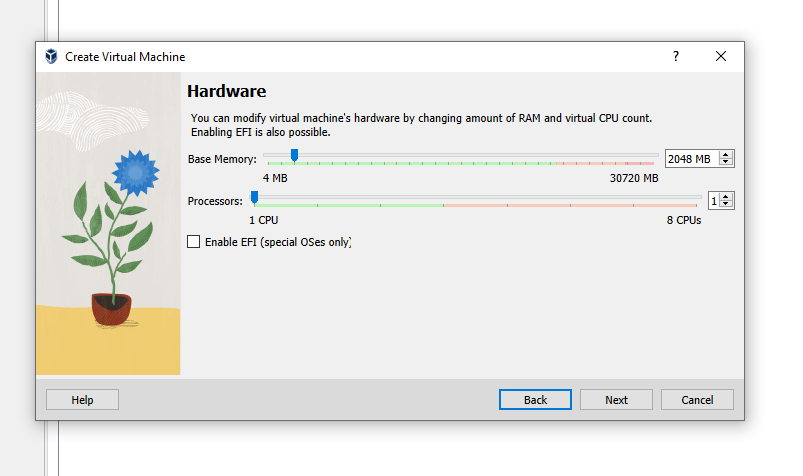
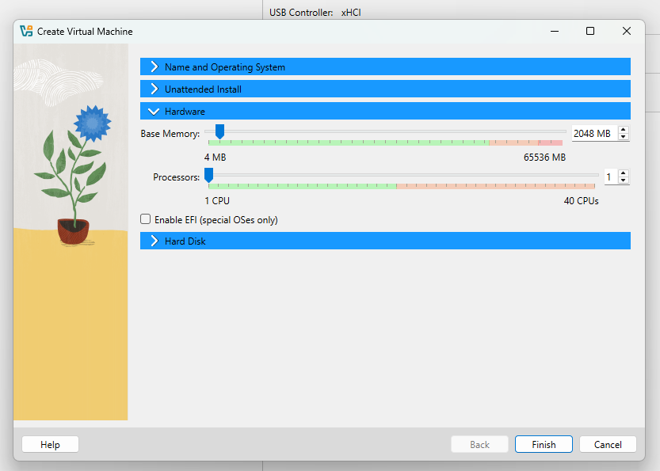
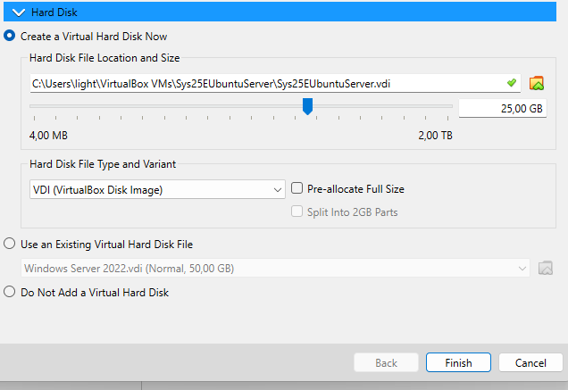

# Setting up the environment
This guide walks you through setting up a virtual environment for cybersecurity learning and experimentation. The environment is designed to include various virtual machines (VMs) managed through VirtualBox 7.0.12.

## Install virtual box
All the VMs are configured and executed in Virtual box  executing on a windows 10 host.
Download Virtual box, and follow the install wizard.

I provide two links for virutal box. One for version 7.0.12, and one for the newer version 7.1.6.
If you are on Windows 10. Then the older version might work better.

Virtual box 7.1.6 can be downloaded from this link: [https://download.virtualbox.org/virtualbox/7.1.6/VirtualBox-7.1.6-167084-Win.exe](https://download.virtualbox.org/virtualbox/7.1.6/VirtualBox-7.1.6-167084-Win.exe)
  
Virtual box 7.0.12 can be downloaded from this link: [https://download.virtualbox.org/virtualbox/7.0.12/VirtualBox-7.0.12-159484-Win.exe](https://download.virtualbox.org/virtualbox/7.0.12/VirtualBox-7.0.12-159484-Win.exe)
  
## Unpacking the the downloaded VMs.
Most VM are compressed with 7zip when downloaded. Therefor you should download and install 7zip from [https://www.7-zip.org/](https://www.7-zip.org/)
  
## Setting up Kali Linux VM
  
1. Download the Kali Linux VirtualBox VM from [https://cdimage.kali.org/kali-2025.4/kali-linux-2025.4-virtualbox-amd64.7z](https://cdimage.kali.org/kali-2025.4/kali-linux-2025.4-virtualbox-amd64.7z).
2. Extract the downloaded 7z zip file to a folder (e.g., `C:\vms`).
3. Add the extracted Kali Linux VM to VirtualBox by clicking _Machine_ -> _Add_ and selecting the _.vbox_ file.  
  
4. Start the Kali Linux instance.
5. When prompted for credentials, enter the username `kali` and password `kali`.
6. Open a terminal window by pressing `Ctrl+Alt+T`.
7. Set the keyboard layout language to your respective keyboard layout with the command `setxkbmap -layout <language identifier>` (e.g., `setxkbmap -layout dk` for Danish). _This command only sets the layout for the session. How to persist the change can be explored separately._
8. Update your Kali Linux VM by executing the command `apt update && apt upgrade`.
9. Shutdown the Kali Linux VM.
  
## Setting up Metasploitable VM
  
1. Download the Metasploitable zip file from [https://sourceforge.net/projects/metasploitable/files/Metasploitable2/](https://sourceforge.net/projects/metasploitable/files/Metasploitable2/).
2. Unzip the file to a folder (it is recommended to keep all your VMs in the same top-level folder).
3. In VirtualBox, create a new VM by clicking _Machine_ -> _New_.  
  
4. In the setup wizard, choose an appropriate name for the VM (e.g., Metasploitable) and folder. Set `ISO image` to `<not selected>`. Set type to `Linux` and `Version` to `Ubuntu (64-bit)`.  
  
5. Set the `Base memory` to `2048 MB` and `Processors` to `1 CPU`.  
  
6. Choose `Use existing virtual hard disk file` and click the `Hard Disk Selector icon`.  
  
7. In the `Hard Disk Selector`, click `Add` and choose the .vmdk file from the unzipped Metasploitable folder.  
  

**Note: You should not start the VM just yet.**
   
## Setting up the Network
By default, Virtual box assigns all VMs the same ip address. We will change this by creating a NAT network.

### Creating a NAT Network
1. Open VirtualBox network manager by clicking _File_ -> _Tools_ -> _Network Manager_.  
  
2. Click the `NAT Networks` pane and then click `Create`.  
  
3. In the `General Options` pane of the created NAT network, change the name to `DefaultVMNet`. Set `IPv4` to `10.0.2.0/24`, and ensure that `Enable DHCP` is **unchecked**.  
  
  
### Adding VMs to the NAT network
_These instructions should be performed on both of the previously created VMs and all VMs created in the future._  
1. Go to the settings of the VM.  
  
2. Select the `Network` option and click the `Adapter 1` pane.  
3. Ensure that `Enable Network Adapter` is checked and set `Attached to` as `NAT Network`.  
4. Set the `Name` to `DefaultVMNet`.  
5. Expand the `Advanced` options and click `Generate MAC Address` on the left-hand side of the `MAC address` text field.  
  

Perform steps 1 to 5 for all VMs.
  
_Beware, unlike VMWare workstation, there is not at NAT network between host and vms (Although one could be created)_
  
### Configuring Static IP Address  
  
In the network manager, DefaultVMNet has its address set to 10.0.2.0 and subnet address to 255.255.255.0.
This creates the network as shown in the table below.  
  
| Description            | Value         |
| ---------------------- | ------------- |
| Total number of IP addresses | 256       |
| Number of usable IP addresses | 253     |
| Network                 | 10.0.2.0      |
| Gateway                 | 10.0.2.1      |
| Broadcast               | 10.0.2.255    |
| First usable IP address | 10.0.2.2      |
| Last usable IP address  | 10.0.2.254    |
  
We will now assign static IP addresses within this network to the Kali VM and Metasploitable VM.
  
#### Kali
Setting up a static IP address on Kali Linux is somewhat straightforward and can be accomplished from the command line. If the issue with persisting the keyboard layout for Kali remains unsolved, remember that you can change the layout for the session using the command `setxkbmap -layout dk` (replace _dk_ with the desired language abbreviation).

1. Start the Kali VM and open a terminal by pressing `Ctrl+Alt+T`.
2. Edit the network configuration file by executing the command `nano /etc/network/interfaces`.
3. Append the following text to the file:
    ```
    auto eth0
    iface eth0 inet static
    address 10.0.2.2/24
    gateway 10.0.2.1
    ```  
    _If `auto eth0` is already defined in the file, you should overwrite that._  
      
4. Save the changes by pressing `Ctrl+S`, and exit Nano by pressing `Ctrl+X`.  
5. Restart the network process by executing the command `systemctl restart networking`.  
6. Open the `resolv.conf` file with the command `nano /etc/resolv.conf`.  
7. Add the line `nameserver 8.8.8.8`.  
8. Save the change by pressing `Ctrl+S`, and exit Nano by pressing `Ctrl+X`.  
9. Test the network configuration by executing the command `ping www.google.com` to send ping packets to Google. If you receive a response, the configuration is working.
   
#### Metasploitable (Ubuntu)
Metasploitable runs on a distribution of Ubuntu 8.x, which is somewhat outdated and not designed for extensive human interaction. Consequently, changing its configurations might be more challenging compared to Kali and newer Ubuntu versions, but it is feasible.

1. Start the Metasploitable VM.
2. When prompted for credentials, authenticate using the default credentials: `Username: msfadmin`, `Password: msfadmin`.
3. Set the keyboard layout to your desired language using the command `loadkeys <language code>` (e.g., `loadkeys dk` for Danish).
4. Edit the network configuration file by executing the command `nano /etc/network/interfaces`.
5. Append the following text to the configuration file:
    ```
    auto eth0
    iface eth0 inet static
    address 10.0.2.3
    netmask 255.255.255.0
    network 10.0.2.0
    broadcast 10.0.2.255
    gateway 10.0.2.1
    dns-nameservers 8.8.8.8
    ```
    _If `auto eth0` is already defined in the file, you should overwrite that._  
      
6. Save the changes to the file by pressing `Ctrl+S`, and exit Nano by pressing `Ctrl+X`.
7. Restart the network service by executing the command `/etc/init.d/networking restart`.
8. Test the network settings by pinging Google using the command `ping www.google.com`.
  
Here is a revised version of the network connection testing instructions:

#### Testing the network connection between Metasploitable and Kali Linux
It is crucial to ensure proper network communication between the Kali VM and the Metasploitable VM. To verify the correct configuration, a final test involves pinging the Kali VM from the Metasploitable VM.
When testing network connections, the standard method involves using the [ping command](https://linux.die.net/man/8/ping). This command utilizes the Internet Control Message Protocol (ICMP) to send a request and waits for a successful response.
While testing ICMP connectivity doesn't necessarily require using Tcpdump, it helps verify that the host responding to the ICMP request matches the host against which the connectivity was tested. Although it might seem redundant in a small setup like this, it's a good practice, especially in larger environments or when working during late hours with a tired mind.

Here are the steps to conduct this test:

1. Power on both the Kali VM and the Metasploitable VM.
2. In the Kali VM, initiate the host network monitor _tcpdump_ by executing the command `tcpdump icmp`. The 'ICMP' parameter instructs tcpdump to produce output specifically when an ICMP request is received.
3. In the Metasploitable VM, send an ICMP request to the Kali VM by executing the command `ping 10.0.2.2`.
4. Verify in the Metasploitable VM that a response to the ICMP request from the Kali VM is received.
5. In the Kali VM, confirm that Tcpdump has generated an output line in the CLI for each ICMP request.
  
### Recovery (Restore points)
When experimenting or altering VM configurations, unexpected issues can arise, disrupting their intended functionality. While these issues are typically fixable, troubleshooting can be time-consuming and distract from learning key concepts. To prevent such setbacks, it's wise to create restore points (snapshots) for each VM in your environment. This allows you to revert each VM to a previously working state. Always create a snapshot before making any significant changes to a VM's setup or configurations.
  
Follow these steps to create a snapshot for a VM in VirtualBox:

1. In VirtualBox, locate and select the desired VM from the VM list.
2. Click on the `Options` icon to the right of the VM name and then select `Snapshots`.  
   
3. Inside the `Snapshots` window, click the `Take` button.  
   
4. Provide a name and description for the snapshot that indicates the current state of the VM.  
   

By following these steps, you'll create a snapshot of the current state of the VM. Each subsequent snapshot will appear indented below the previous one in the list.

**Remember to consistently create restore points. Neglecting this practice might lead to extensive troubleshooting in the event of OS misconfigurations.**
   
### Setting Up Ubuntu Server VM:
Canonical who maintain Ubuntu, does not provide a prebuilt image, so unlike Kali and Metasploitable. We will have to 
first create a virtual machine, and the install ubuntu onto the virtual machine.


#### VM Creation:

1. **Download Ubuntu Server 24.04.4 ISO**:
   - Obtain the ISO file from the official Ubuntu website: [https://ubuntu.com/download/server](https://ubuntu.com/download/server).

2. **Create a New VM in VirtualBox**:
   - Navigate to `Machine -> New`.
   - Provide the server VM with an appropriate name.    
   - Select "Other" for the `ISO image` and browse for the downloaded Ubuntu Server ISO file.   
   - **Important** Ensure that _Skip Unattended installation_ is **Checked**
       
     

3. **Configure VM Settings**:
   - Unfold the _Hardware_ tab, and Allocate 2GB RAM and start with 1 CPU.  
          
   - Unfold the _Hardware_ tab and set the size to 25GB.  
          

4. **Finalize VM Creation**:
   - Click `Finish` and await the completion of the VM creation process.

5. **Configure VM Network Settings**:
   - Once the VM is created, configure the VM's network settings as defined in the section [Adding VM to the NAT Network](./EnviromentSetup.md#adding-vms-to-the-nat-network).

#### Ubuntu Server Setup:


1. **Start Ubuntu Server VM and Initiate Installation**:
   - Start the Ubuntu Server VM and wait for the installation wizard to appear.
   - Choose `Ubuntu Server` when prompted for the `type of install`.

2. **Configure Network Settings**:
   - In the `Network connections` menu, mark the network interface and press `space`.
   -  
   - Select `Edit IPv4` and choose `Manual` for `IPv4`.
   - Enter the network information as shown below in the pictur.  ( Most of the configurations can also be found in [Configuring static ip address](#configuring-static-ip-address) section. )    
   -  *(Note: the subnet is written in CIDR format)*  

3. **Complete Installation**:
   - Follow the remaining installation steps; typically, the process is straightforward.
   - Remember to update the Ubuntu instance using the command `apt update && apt upgrade`.
  
### Setting up Windows 11 VM:

1. **Download Windows 11 Prebuilt VM**:
   - Obtain the prebuilt Windows 11 VM from [Microsoft's VM download page](https://developer.microsoft.com/en-us/windows/downloads/virtual-machines/).
   
2. **Unzip the Downloaded File**:
   - Extract the downloaded file to a suitable folder.

3. **Import the VM in VirtualBox**:
   - Open VirtualBox and navigate to `Files -> Import Appliance`.
   - Browse for the unzipped OVA file.
   - 
   
4. **Complete VM Import**:
   - Finish the import process and wait for the VM to be created.

5. **Configure VM Network Settings**:
   - Configure the VM's network settings as defined in the section [Adding VM to the NAT Network](#adding-vm-to-the-nat-network).
   
6. **Start the Windows 11 VM**:
   - Begin running the VM.

7. **Set Up Windows 11 with Static IP**:
   - Follow a tutorial like [Configuring static ip in Windows 11](https://www.google.com/search?q=setting+static+ip+on+windows+11&oq=setting+static+ip+on+windows+11&  gs_lcrp=EgZjaHJvbWUyBggAEEUYOTIHCAEQABiABDIHCAIQABiABDIHCAMQABiABDIICAQQABgWGB4yCAgFEAAYFhgeMggIBhAAGBYYHjIICAcQABgWGB4yCAgIEAAYFhgeMggICRAAGBYYHtIBCDUyODZqMGo3qAIAsAIA&sourceid=chrome&ie=UTF-8#fpstate=ive&ip=1&vld=cid:20831224,vid:w_dMQePa0sQ,st:0).
   - Set the IP address to `10.0.2.5` and configure the remaining settings according to the instructions in the [Configuring static ip adresse](#configuring-static-ip-address) section.
   
   > Note: Windows firewall does not allow ICMP packages by default; you'll need to create a firewall rule to permit this.
    
### Resource requirements
Resource usage (requirements): 16GB+ (32GB recommended)
_The resource usage differ depending on the number of running VMs. Omitting the windows VM, lowers the resource usage significantly_


### Exporting the images
Once a VM has been configured and software installed, it can be exported so that the VM may be used on other hardware. You can export a VM in VirtualBox with the following steps:

1. In VirtualBox, click **File -> Export Appliance**.
2. Choose the VM you wish to export.
3. Make the following selections:
   - Set `Format` to `Open Virtualization Format 2.0`.
   - In `File`, set the folder where the exported VM should be located along with a filename (Ensure you have the .ova extension on the filename).
   - In `MAC Address Policy`, select `Strip all network adapter MAC address` (This ensures that the MAC address from the current setup is not reused).
   - In `Additionally`, ensure the `Write Manifest file` is checked, and that `Include ISO image files` is unchecked.
4. In the prompted `Appliance settings` menu, verify that all settings are correct and click Finish.
5. Wait for the appliance writing to finish.

Now you have a premade VM image ready to use. Of course, you need to make some configuration changes in the VM, such as the IP address.


