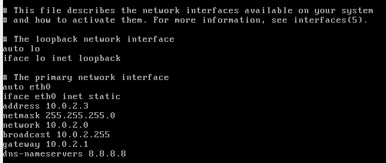

# Setting up the environment

## Install virtual box
All the VMs are configured and executed in Virtual box 7.0.12 executing on a windows 10 host.
Download Virtual box  7.0.12, and follow the install wizard.

Virtual box 7.0.12 can be downloaded from this link: [https://download.virtualbox.org/virtualbox/7.0.12/VirtualBox-7.0.12-159484-Win.exe](https://download.virtualbox.org/virtualbox/7.0.12/VirtualBox-7.0.12-159484-Win.exe)
  
## Unpacking the the downloaded VMs.
Most VM are compressed with 7zip when downloaded. Therefor you should download and install 7zip from [https://www.7-zip.org/](https://www.7-zip.org/)

## Setting up Kali Linux VM

1. Download the kali linux virtual box VM from [https://cdimage.kali.org/kali-2023.4/kali-linux-2023.4-virtualbox-amd64.7z](https://cdimage.kali.org/kali-2023.4/kali-linux-2023.4-virtualbox-amd64.7z)
2. Extract the downloaded 7z zip file to a folder (E.g. c:\vms)
3. Add the extracted Kali Linux VM to virtual box by clicking _Machine->add_ and select the _.vbox_ file.  
  
4. Start the Kali linux instance
5. when prompted for credentials, enter user name `kali` and password `kali`
6. open up a terminal window by pressing `ctrl+alt+t`
7. Set the keyboard layout language to your respective keyboard layout with the command ´setxkbmap -layout <language identifier>´ (E.g. `setxkbmap -layout dk` for danish).
_The command only sets the layout for the session, i will leave it as an exercise to figure out how to persist the change_
8. update your Kali Linux VM by executing the command `sudo apt update && sudo apt upgrade`.
9. Shutdown the Kali Linux

## Setting up Metasploitable VM

1. Download the Metasploitable zip file from [https://sourceforge.net/projects/metasploitable/files/Metasploitable2/](https://sourceforge.net/projects/metasploitable/files/Metasploitable2/)
2. Unzip the file to a folder (i suggest that you keep all your VMs in the same top level folder) 
3. In Virtualbox, create a new VM by clicking _Machine->new_  
  
4. In the setup wizard, choose an appropriate name for the VM (E.g. Metasploitable) and folder. Set `Iso image` to `<not selected>`. Set type to `Linux` and `Version` to `Ubuntu (64-bit)`  
  
5. Set the `Base  memory` to `2048 MB` and `Processors` to `1 CPU`.  
  
6. Choose `Use existing virtual hard disk file`, and click the `Hard Disk Selector icon`  
  
7. In `Hard Disk Selector`, click `Add`, and choose the .vmdk file from the unzipped Metasploitable folder  
  
  
You **shouldn't start** the VM just yet. But the default credentials are `username msfadmin`, and `password msfadmin`.
  
## Setting up the Network
By default, Virtual box assigns all VMs the same ip address. We will change this by creating a NAT network.

### Creating a NAT Network
1. Open Virtual box  network manager by clicking _File->Tools->Network manager_  
  
2. Click the `NAT Networks` pane, and click create  
  
3. In the `General Options` pane of the created NAT network change the name to `DefaultVMNet`, and set ´IPv4´ to ´10.0.2.0/24´ and ensure that `Enable DHCP` is **unchecked**   
  
  
### Adding VM to the NAT network
_These instructions should be performed on both of the previous created VMs, and all VMs created in the future_  
1. goto the settings of the VM  
  
2. Select the `Network` option, and click the Adapter 1 pane.  
3. Ensure that ´Enable Network Adapter´ is checked, and set ´Attached to´ as ´NAT Network´  
4. Set the ´Name´ to ´DefaultVMNet´
5. Unfold the `Advanced` options, and click the `Generate MAC Address` on the left hand side of the `MAC address` text field  

  
Perform step 1 to 5 for all VMs

_Beaware, unlike VMWare workstation, there is not at NAT network between host and vms (Although one could be created)_
  
### Configuring static ip address  
  
In the network manager, DefaultVMNet had its address set to 10.0.2.0 and subnet address to 255.255.255.0.
This create the network as shown in the table below.  
  
| Description    | Value |
| -------- | ------- |
|Total number of ip addresses|256|
|Number of usable ip address|253|
|Network|10.0.2.0|
|Gateway|10.0.2.1|
|Broadcast|10.0.2.255|
|First usable ip address |10.0.2.2|
|Last usable ip address |10.0.2.254|
  
We will now assign static ip addresses within this network to the Kali VM and Metasploitable VM.
  
#### Kali
Setting up static ip address on Kali Linux is somewhat straight forward. We will do this from the
command line. In case you did not solve the issue with persisting the keyboard layout for Kali, remember
you change the layout for the session, with the command `setxkbmap -layout dk` (replacing _dk_ with the language abbreviation you desire).

1. Start the Kali VM, and open a terminal by pressing ´ctrl+alt+t´
2. Edit the network configuration file by executing the command `$ sudo nano /etc/network/interfaces`
3. Append the following text to the file:  
```
auto eth0
iface eth0 inet static
address 10.0.2.2/24
gateway 10.0.2.1
```  
_If auto eth0 is already defined in the file, you should overwrite that_  
  
4. Save the changes by pressing `ctrl+s` and exit nano by pressing `ctrl+x`.  
5. restart the network process by executing the command `sudo systemctl restart networking`  
6. Open the `resolv.conf` file with the command `sudo nano /etc/resolv.conf`   
7. Add the line `nameserver 8.8.8.8`  
8. Save the change by pressing `ctrl+s` and exit nano by pressing `ctrl+x`  
9. Test the network configuration by executing the command `ping www.google.com` sending ping packages to google. If you are getting a response, the configuration is working.  
  
#### Metasploitable (Ubuntu)
Metasploitable is based on a Ubuntu 8.x distribution of Linux and is somewhat outdated. Further more it is not designed nor
build a lot of human interaction. Therefor it can be a bit more tricky to change its configurations (Compared to Kali, and newer Ubuntu versions), but by no means impossible nor
to difficult.

1. Start the Metasploitable VM
2. When prompted for credentials, Authenticate using the default credentials `Username: msfadmin password: msfadmin`
3. Set the keyboard layout to your desired language with the command `loadkeys <langauge code>` (E,g, `loadkeys dk` for danish)
4. Edit the network configuration file, by executing the command `$ sudo nano /etc/network/interfaces`
5. In the configuration file, append the following text:
```
auto eth0
iface eth0 inet static
address 10.0.2.3
netmask 255.255.255.0
network 10.0.2.0
broadcast 10.0.2.255
gateway 10.0.2.1
dns-nameservers 8.8.8.8
```  
_If auto eth0 is already defined in the file, you should overwrite that_  
  
  
  
6. Save the changes to the file by pressing `ctrl+s` and exit nano by pressing `ctrl+x`
7. Restart the network service by executing the command `sudo /etc/init.d/networking restart`
8. Test the network setting by pinging Google, with the command `ping www.google.com`


#### Testing the network connection between metasploitable and Kali Linux
It is important that the Kali VM and the Metasploitable VM can communicate on the network, so the final 
test to validate correct configuration, is to ping the Kali VM from the Metasploitable VM.
  
Often when testing network connections, a ping request is sent using the [ping command](https://linux.die.net/man/8/ping). This command
sends a request using the Internet control message protocol (ICMP) and awaits a successful response to the request.
In the test, the application Tcpdump is used on the receiving VM (Kali). Using Tcpdump is not necessary to test network connectivity with ICMP requests,
but it does verify that the host responding to the ICMP request, is the host that connectivity where tested towards. Strictly speaking, this is seems redundant in
a small setup such as this. But it is a good  habit, that will come in handy when you are testing in bigger environments, or in the late hours with a tired mind.
  
1. Turn on the Kali VM and The Metasploitable VM.
2. In the Kali VM, start the host network monitor _tcpdump_ by executing the command `tcpdump icmp`. the  ICMP parameter, specifies that tcpdump should only create output, when a ICMP request is received
3. In the Metasploitable VM, send a ICMP request to the kali VM by executing the command `ping 10.0.2.2` 
4. In the Metasploitable VM, verify that a response to the ICMP request is received.
5. In the Kali VM, verify that Tcpdump have create an output line in the CLI for each ICMP request.

### Recovery (Restore points)
When experimenting or changing configurations of VMs, an unintended side effect often is that something goes wrong and they
stop working in the intended manner. Usually this can be fixed, but fixing it can be time consuming, and an unwanted distraction from
learning more general concepts. Therefor it is a good idea to create restore points(snapshots) for each VM in the environment, so that each vm  
can be restored to a functioning state. In the subsequent steps, you will be show how to do this. You should do this for each of your VMs, and you
should always do it, before making any changes to the configurations or setup of the VM (Major ones at least).  

1. In Virtual box, click the `options` icon to the right of the VM name and select `snapshots`  
  
2. Click the `Take` button  
  
3. Give the snapshot a name that relates to the current state of the VM, and a description  
  

That is all there is to it. Next time you create a snapshot of the VM an additional entry will appear indented after the previous snapshot.  

    
**Always remember to create restore points. Forgetting it, can present you with a hard lesson in debugging OS misconfigurations**

### Ubuntu

### Windows
2. Set up Windows 11 virtual machine
 _Windows firewall does not by default allow ICMP packages_
    Download a windows 11 developer vm from https://developer.microsoft.com/en-us/windows/downloads/virtual-machines/ (Windows 11) (Select virtualbox)
    _The VM is using  a evaluation license, alternatively if you have access to Azure student subscription, you can get a non evaluation windows version from there_
    Unzip the vm
    In virtual box, click _Files -> Import appliance _
    Select the unzipped OVA file
    Finish the import
     Goto the settings of the vm and click on the network settings. Click adapter 1 tab and set `Attached to` to `NAT Network`, set the `Name` to `DefaultVMNet`, and regenerate the Mac address

### Resource requirements
Resource usage (requirements): 16GB+ (32GB recommended)
_The resource usage differ depending on the number of running VMs. Omitting the windows VM, lowers the resource usage significantly_


