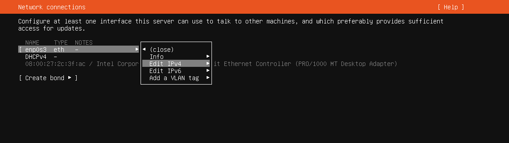
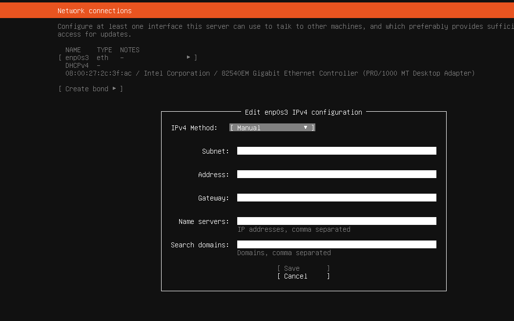

**Most of the downloaded VMs are zipped with 7zip**
Tutorial used:  https://subscription.packtpub.com/video/security/9781803241920/p1/video1_3/set-up-kali-as-a-virtual-machine-virtualbox

Resource usage (requirements): 16GB+ (32GB recommended)
_The resource usage differ depending on the number of running VMs. Omitting the windows VM, lowers the resource usage significantly_

# Setting up the enviroment

## Install virtual box
All the VMs are configured and executed in Virtual box 7.0.12 executing on windows 10.
Download Virtual box  7.0.12, and follow the install wizard.

_Beaware, unlike VMWare workstation, there is not at NAT network between host and vms (Although one could be created)_

## Unpacking the the downloaded VMs.
Most VM are compressed with 7zip when downloaded. Therefor you should download and install 7zip from [https://www.7-zip.org/](https://www.7-zip.org/)

## Setting up Kali Linux VM

1. Download the kali linux virtual box VM from [https://cdimage.kali.org/kali-2023.4/kali-linux-2023.4-virtualbox-amd64.7z](https://cdimage.kali.org/kali-2023.4/kali-linux-2023.4-virtualbox-amd64.7z)
2. Extract the downloaded 7z zip file to a folder (E.g. c:\vms)
3. Add the extracted Kali Linux VM to virtual box by clicking _Machine->add_ and select the _.vbox_ file.  
  
4. Start the Kali linux instance
5. when prompted for credentials, enter user name `kali` and password `kali`
6. open up a terminal window by pressing `ctrl+alt+t`
7. Set the keyboard layout language to your respective keyboard layout with the command ´setxkbmap -layout <language identifier>´ (E.g. `setxkbmap -layout dk` for danish).
_The command only sets the layout for the session, i will leave it as an exercise to figure out how to persist the change_
8. update your Kali Linux VM by executing the command `sudo apt update && sudo apt upgrade`.
9. Shutdown the Kali Linux

## Setting up Metasploitable VM

1. Download the Metasploitable zip file from [https://sourceforge.net/projects/metasploitable/files/Metasploitable2/](https://sourceforge.net/projects/metasploitable/files/Metasploitable2/)
2. Unzip the file to a folder (i suggest that you keep all your VMs in the same top level folder) 
3. In Virtualbox, create a new VM by clicking _Machine->new_  
  
4. In the setup wizard, choose an appropriate name for the VM (E.g. Metasploitable) and folder. Set `Iso image` to `<not selected>`. Set type to `Linux` and `Version` to `Ubuntu (64-bit)`  
  
5. Set the `Base  memory` to `2048 MB` and `Processors` to `1 CPU`.  
  
6. Choose `Use existing virtual hard disk file`, and click the `Hard Disk Selector icon`  
  
7. In `Hard Disk Selector`, click `Add`, and choose the .vmdk file from the unzipped Metasploitable folder  
  
  
You **shouldn't start** the VM just yet. But the default credentials are `username msfadmin`, and `password msfadmin`.
  
## Setting up the Network
By default, Virtual box assigns all VMs the same ip address. We will change this by creating a NAT network.

### Creating a NAT Network
1. Open Virtual box  network manager by clicking _File->Tools->Network manager_  
  
2. Click the `NAT Networks` pane, and click create  
  
3. In the `General Options` pane of the created NAT network change the name to `DefaultVMNet`, and set ´IPv4´ to ´10.0.2.0/24´ and ensure that `Enable DHCP` is **unchecked**   
  
  
### Adding VM to the NAT network
_These instructions should be performed on both of the previous created VMs, and all VMs created in the future_  
1. goto the settings of the VM  
  
2. Select the `Network` option, and click the Adapter 1 pane.  
3. Ensure that ´Enable Network Adapter´ is checked, and set ´Attached to´ as ´NAT Network´  
4. Set the ´Name´ to ´DefaultVMNet´
5. Unfold the `Advanced` options, and click the `Generate MAC Address` on the left hand side of the `MAC address` text field  

  
Perform step 1 to 5 for all VMs
  
### Configuring static ip address  
  
In the network manager, DefaultVMNet had its address set to 10.0.2.0 and subnet address to 255.255.255.0.
This create the network as shown in the table below.  
  
| Description    | Value |
| -------- | ------- |
|Total number of ip addresses|256|
|Number of usable ip address|253|
|Network|10.0.2.0|
|Gateway|10.0.2.1|
|Broadcast|10.0.2.255|
|First usable ip address |10.0.2.2|
|Last usable ip address |10.0.2.254|
  
We will now assign static ip addresses within this network to the Kali VM and Metasploitable VM.
  
### Kali
1. Start the Kali VM, and open a terminal by pressing ´ctrl+alt+t´
2. Edit the network configuration file by executing the command `$ sudo nano /etc/network/interfaces`
3. Append the following text to the file:
```
auto eth0
iface eth0 inet static
address 10.0.2.2/24
gateway 10.0.2.1
```
_If auto eth0 is already defined in the file, you should overwrite that_  
  
4. Save the changes by pressing `ctrl+s` and exit nano by pressing `ctrl+x`.
5. restart the network process by executing the command `sudo systemctl restart networking`
6. Open the `resolv.conf` file with the command `sudo nano /etc/resolv.conf` 
7. Add the line `nameserver 8.8.8.8`
8. Save the change by pressing `ctrl+s` and exit nano by pressing `ctrl+x`
9. Test the network configuration by executing the command `ping www.google.com` sending ping packages to google. If you are getting a response, the configuration is working.

### Metasploitable (Ubuntu)
Start the VM
Default credentials: user: msfadmin password:msfadmin
loadkeys dk (Sets for keyboard layout for the session )
`$ sudo nano /etc/network/interfaces`
Add in the bottom (if eth0 is already defined, it should be removed)
```
auto eth0
iface eth0 inet static
address 10.0.2.3
netmask 255.255.255.0
network 10.0.2.0
broadcast 10.0.2.255
gateway 10.0.2.1
dns-nameservers 8.8.8.8
```
`sudo /etc/init.d/networking restart`
Test with `ping www.google.com`

### Testing the network connection between metasploitable and Kali Linux
turn on both VMs
in kali execute `tcpdump icmp`
in metasploit execute ´ping 10.0.2.2´

Verify that kali linux recieves the pings

    
2. Set up Windows 11 virtual machine
 _Windows firewall does not by default allow ICMP packages_
    Download a windows 11 developer vm from https://developer.microsoft.com/en-us/windows/downloads/virtual-machines/ (Windows 11) (Select virtualbox)
    _The VM is using  a evaluation license, alternatively if you have access to Azure student subscription, you can get a non evaluation windows version from there_
    Unzip the vm
    In virtual box, click _Files -> Import appliance _
    Select the unzipped OVA file
    Finish the import
     Goto the settings of the vm and click on the network settings. Click adapter 1 tab and set `Attached to` to `NAT Network`, set the `Name` to `DefaultVMNet`, and regenerate the Mac address


4. Create restore points
    click the options icon on the right of each vm in virtualbox and select snapshots, and click `Take`


### Windows

### Ubuntu


