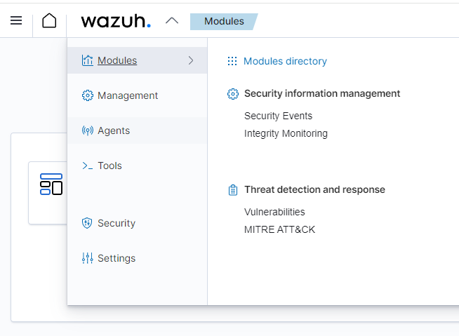
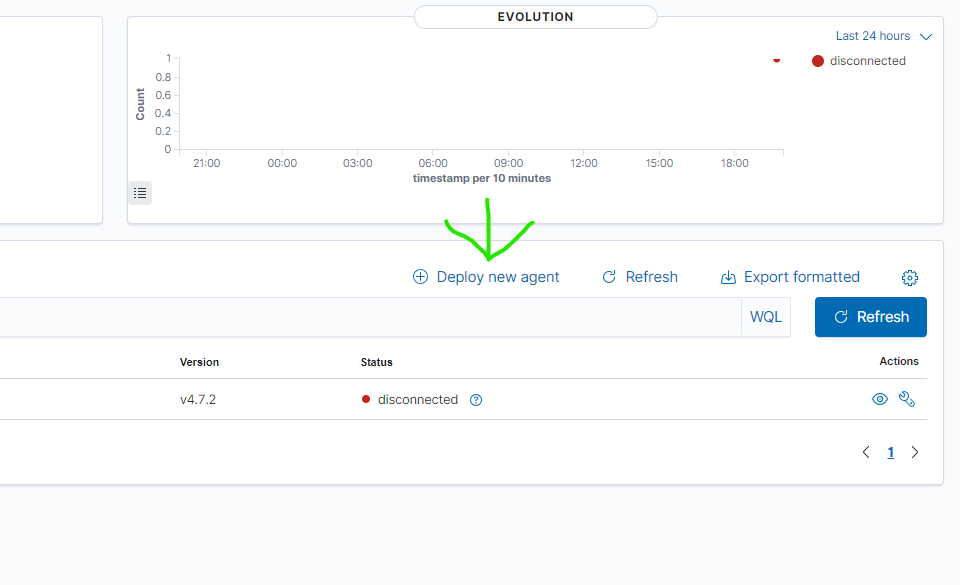
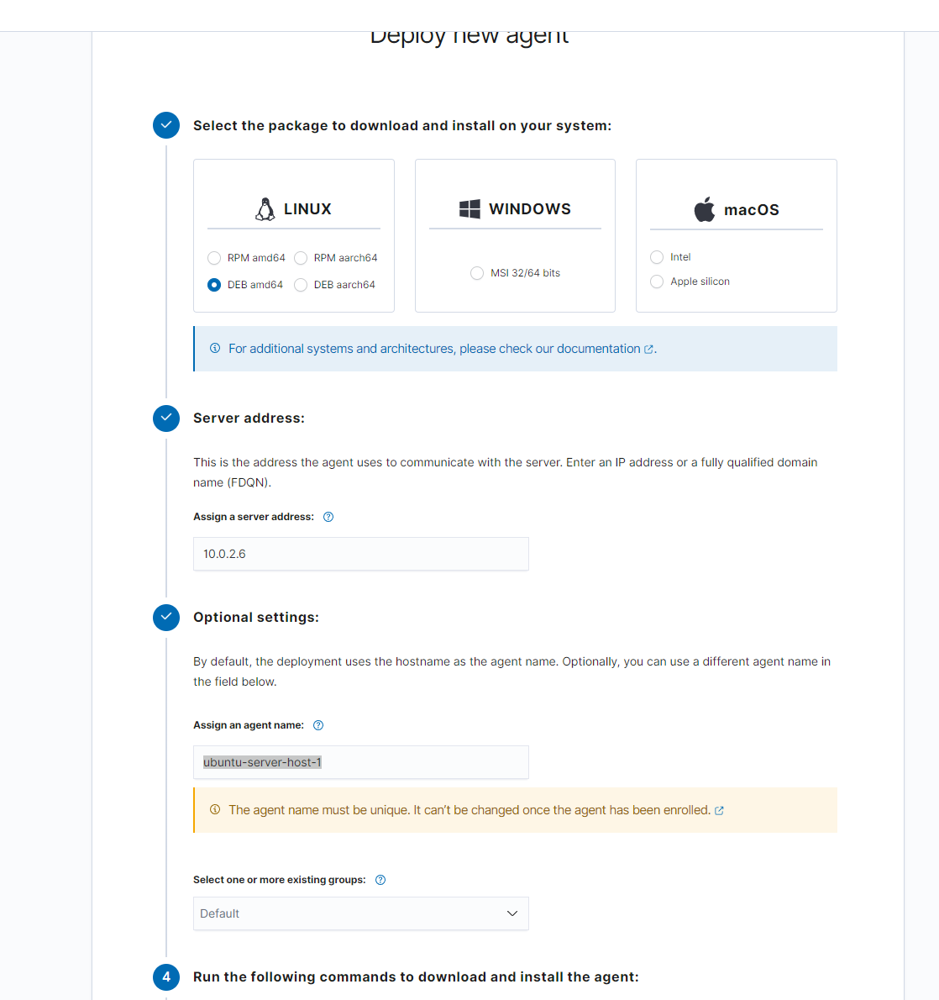
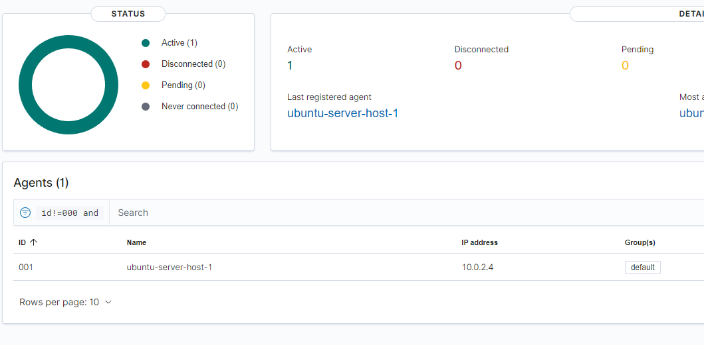

# Setting up a Wazuh agent
This guide is for setting up a Wazuh agent on an Ubuntu server. The process of setting up a Wazuh agent is pretty straightforward, as the Wazuh manager GUI provides very specific instructions for deploying an agent to a specific platform.

## prerequisites
You should have completed the [Wazuh server setup](./WazuhServerSetup.md), and you will also need an Ubuntu server for the Agent deployment.
You can follow the guide [here, for setting up Ubuntu server](./EnvironmentSetup.md#setting-up-ubuntu-server-vm).

## Setting up the Wazuh agent

1. Enter the Wazuh manager GUI at [127.0.0.1:80](https://127.0.0.1:80)
2. Select `Agents` in Wazuh drop down menu.

  
3. In the appearing menu, select `Deploy new agent`
 
   
4. In the appearing menu, Make the following selections:
    
 | package to install | Server adresse | Agent name    | Group |  
 | ----------- | -------- | ---------- | --------- |  
 | DEB amd64 | 10.0.2.6  | Ubuntu_host_1 | Default |  
   
   
   
5. Copy,paste and execute the CLI command in step 4 on Ubuntu server. The command looks something like:
  
```
wget https://packages.wazuh.com/4.x/apt/pool/main/w/wazuh-agent/wazuh-agent_4.7.2-1_amd64.deb && sudo WAZUH_MANAGER='10.0.2.6' WAZUH_AGENT_NAME='Ubuntu_Server' dpkg -i ./wazuh-agent_4.7.2-1_amd64.deb
```  
_There is an error in the Wazuh generated command for Client deployment, which we will fix in the next step_  
  
6. Once the agent has been installed, open up the agents configuration file with the command `nano /var/ossec/etc/ossec.conf` and replace `MANAGER_IP` with 10.0.2.6
7. Save the change by pressing `ctrl+s`, and exit nano by pressing `ctrl+x`
8. Ensure that the Wazuh server is up and running
9. Start the Wazuh agent by executing the following commands  
  
```
sudo systemctl daemon-reload
sudo systemctl enable wazuh-agent
sudo systemctl start wazuh-agent
```  
  
9. The agents log file is located at the path: `/var/ossec/logs/ossec.log`. Look in the log file to confirm that the agent have started correctly.
10. In the Wazuh manager GUI, go into the `Agents` menu, and confirm that the new agent have been registered as active.  
  
  

# Useful File location
  
- The Agent configuration file can be found in the path: `/var/ossec/etc/ossec.conf`
- The Agent log file can be found in the path: `/var/ossec/logs/ossec.log`
