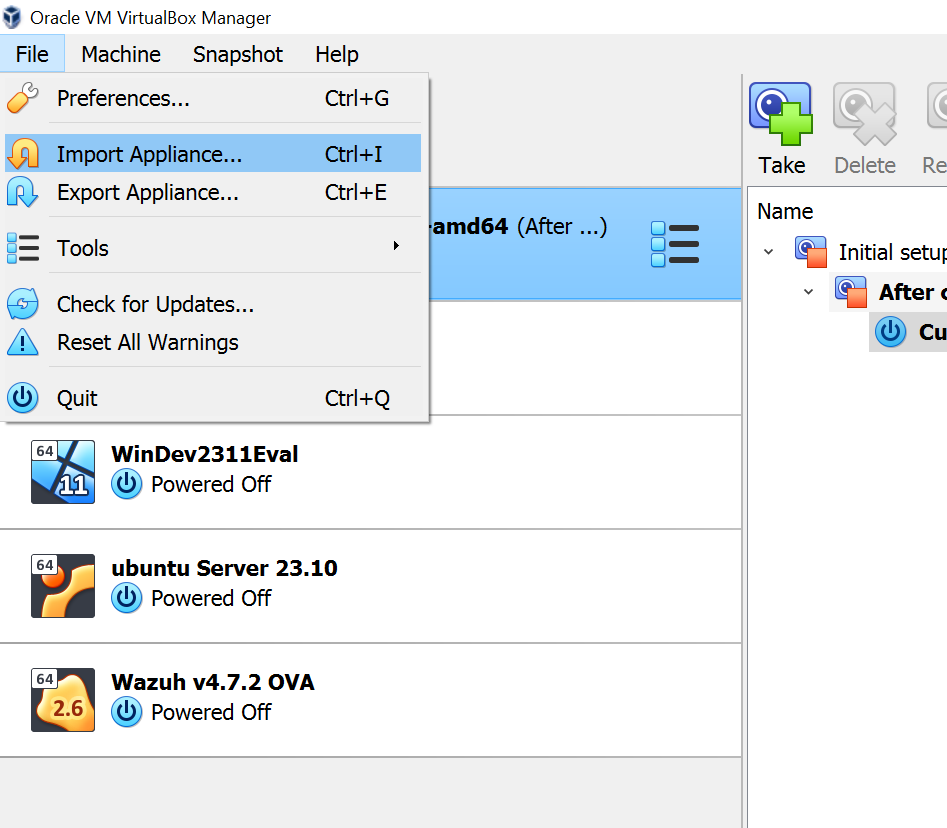
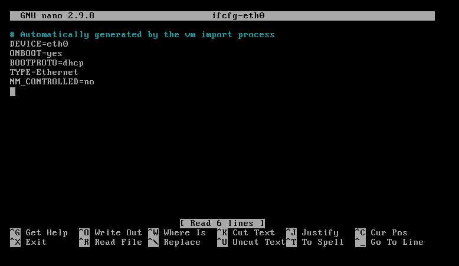
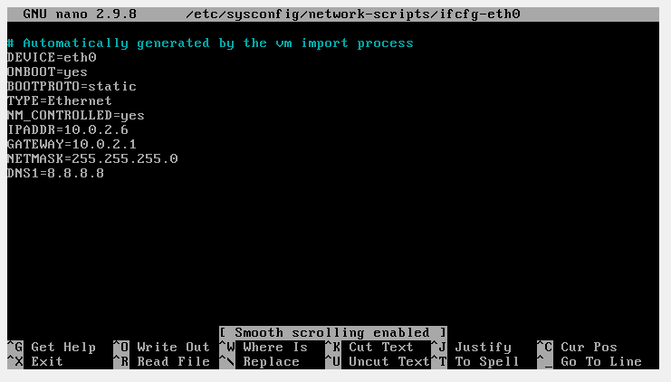

# Wazuh server setup
Wazuh is an open-source Security Information and Event Management (SIEM) and Extended Detection and Response (XDR) platform according to the Wazuh team. A SIEM system primarily focuses on event correlations in a system by collecting logs from various parts of the system. Based on predefined rules, it then creates alerts. Typically, a SIEM system provides an overview of events for an incident response team and relies on human intervention. In contrast, XDR also performs automated responses to events based on the analyzed log data. Essentially, XDR is a superset of SIEM, meaning an XDR system can do what a SIEM system can and more. Thus, Wazuh could justifiably be referred to as an XDR system. If I were to speculate on why they choose to call it a SIEM and XDR system, it might be because SIEM systems represent the older type of systems that are well-established and known. On the other hand, XDR represents the newer type of system. By labeling it as both SIEM and XDR, Wazuh aims to bridge the correlation between Wazuh and traditional SIEM systems while emphasizing its advanced capabilities
  
For more information about Wazuh, visit the official website: [https://wazuh.com/](https://wazuh.com/)
  
Wazuh is an open source project, and the source code can be found in github: [https://github.com/wazuh/wazuh](https://github.com/wazuh/wazuh)
  
Wazuh consists of multiple components and is designed for the distributed deployment of these components. In this guide, for convenience reasons, we only use the single-node deployment provided by the Wazuh OVA VM image. You can get a full overview of the architecture and deployment options on the official Wazuh website at [https://documentation.wazuh.com/current/getting-started/architecture.html](https://documentation.wazuh.com/current/getting-started/architecture.html)
  
While experimenting with Wazuh single-node deployment, I experienced fewer complications using VirtualBox for VM hosting than using VMware. That's why I recommend using VirtualBox. However, the complications I had with VMware could just as well be due to a lack of competence on my side.
  
## prerequisites 
You should have completed the instructions for [installing VirtualBox](./EnviromentSetup.md#install-virtual-box), [Setting up the Network](./EnviromentSetup.md#setting-up-the-network).

The preliminary exercise with Wazuh uses an Ubuntu server as the surveyed host, but later, other host VMs might be used as well. The setup for all host VMs can be found in [Environment setup](./EnvironmentSetup.md)."

## Wazuh server VM
To create the Wazuh server VM (single-node deployment), we will use the [official Wazuh OVA](https://documentation.wazuh.com/current/deployment-options/virtual-machine/virtual-machine.html) VM image. It's worth noting that the virtual machine is not light on resource usage. As of the time of writing, the recommendations are 4 CPU cores and 8GB of RAM. I've experimented with using only 2 CPU cores and 4GB of RAM, which worked, but the performance was somewhat slow, especially during the VM boot process.

### Setting up the Wazuh server VM in virtual box.
To setup Wazuh server on virtualbox, follow the steps outlined below.

I will skip the trivial parts of the VM creation. 

1. Download the offical OVA VM image file using the download link [https://packages.wazuh.com/4.x/vm/wazuh-4.7.2.ova  ](https://packages.wazuh.com/4.x/vm/wazuh-4.7.2.ova)
2. Place the downloaded OVA file in the folder where you wish Wazuh server to be located (E.g. `C:\VMs\Wazuh\`)
3. In virtual box, choose _File->Import Appliance_

4. Browse for the downloaded OVA file and select it
5. Wait for the VM creation to finish up
6. When the VM is created, right click the VM and settings 
7. On the left hand side, Click the `Display` icon.
8. In the `Graphics Controller` drop down menu, select `VMSVGA`
9. On the left hand side, Click the `System` icon.
10. In the `Extended Features` options, Check `Enable Hardware Clock in UTC Time`
11. On the left hand side, Click the `Network` icon
12. In the `Adapter 1` pane, set `Attached to:` as `NAT Network` and Name as `DefaultVMNet`. The procedure is as explained in [Adding VMs to the NAT network](./EnviromentSetup.md#adding-vms-to-the-nat-network)
13. Start the VM
14. When prompted for credentials, authenticate with the default credentials: `Username: wazuh-user` and `Password: wazuh`
15. Once the VM have started. Set the keyboard layout to match your language, with the command `localectl set-keymap <Langauge code>` (E.g. For danish: `localectl set-keymap dk`)
 
### Assigning static ip adresse to Wazuh server VM
To configure a static ip address, some manual text editing in the file `/etc/sysconfig/network-scripts/ifcfg-eth0`  
  
**Prior to following these steps. It is a good idea to create a snapshot (restore point) for the VM**  
   
1. Open the file `/etc/sysconfig/network-scripts/ifcfg-eth0` using the command `nano /etc/sysconfig/network-scripts/ifcfg-eth0`
2. The contents of the file should initially match the picture below  
   
3. Change the content of the file, to match the value below
```
DEVICE=eth0
ONBOOT=yes
BOOTPROTO=static
TYPE=Ethernet
NM_CONTROLLED=yes
IPADDR=10.0.2.6
GATEWAY=10.0.2.1
NETMASK=255.255.255.0
DNS1=8.8.8.8

```  
4. Verify the the contents now match the depicted below    
  
5. Save the changes with by pressing `ctrl+s` and thereafter exit nano by pressing `ctrl+x`
6. Restart the process `network-service` by executing the command `systemctl restart network-service`
7. Verify the correct working of the network configurations, by pinging the server from another host in the NAT network.

### Exposing The Wazuh server to host

Wazuh provides a user interface to view all the data collected by the Wazuh server. Accessing the GUI requires connecting to it from a VirtualBox VM within the NAT network or configuring VirtualBox to forward incoming host requests on a specific port to the Wazuh Server VM port.

The NAT network in VirtualBox is not reachable from the host operating system. To enable the host to reach a VM within the NAT network, you can either provide the host with an additional network adapter using a bridged adapter network (VM connected to the same LAN as the host) or a Host-only adapter. However, for reaching the Wazuh user interface, a more practical solution is adding a port forwarding rule to the NAT network, named "DefaultVMNet."

After setting up the port forwarding rule, you can access the Wazuh GUI at the URL https://127.0.0.1:443. Perform the following network configurations in VirtualBox:

1. Enter _File -> Tools -> Network Manager_.
2. Click on the `NAT Networks` pane.
3. Double-click on the NAT network `DefaultVMNet`.
4. In the bottom menu at the bottom of the screen, click the `Port Forwarding` pane.
5. Click the green plus icon to add a new port forwarding rule.
6. Provide the rule with the following properties shown in the table below:

    | Name      | Protocol | Host IP     | Host Port | Guest IP  | Guest Port |
    | --------- | -------- | ----------- | --------- | --------- | ---------- |
    | Wazuh GUI | TCP      | 127.0.0.1   | 443       | 10.0.2.6   | 443        |

7. Start the Wazuh server VM.
8. In your host OS, enter the URL `https://127.0.0.1:443` in your browser to access the Wazuh user interface.
9. When prompted for credentials, use the default credentials: `Username: admin, Password: admin`.
   _Note: It might take a while for the Wazuh server to start up due to the numerous applications in the single-node deployment._
