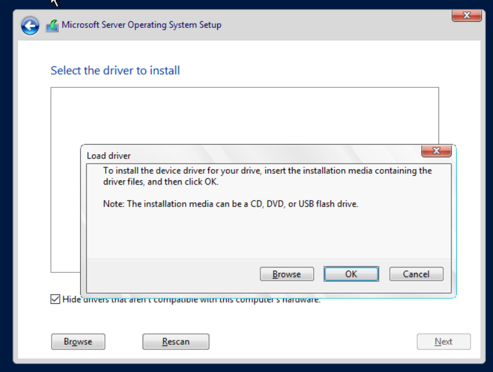
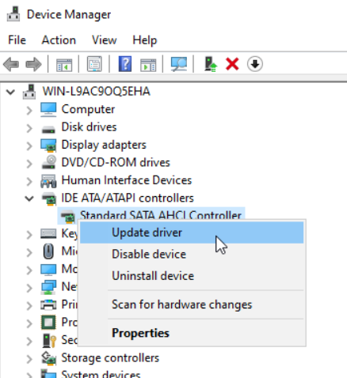
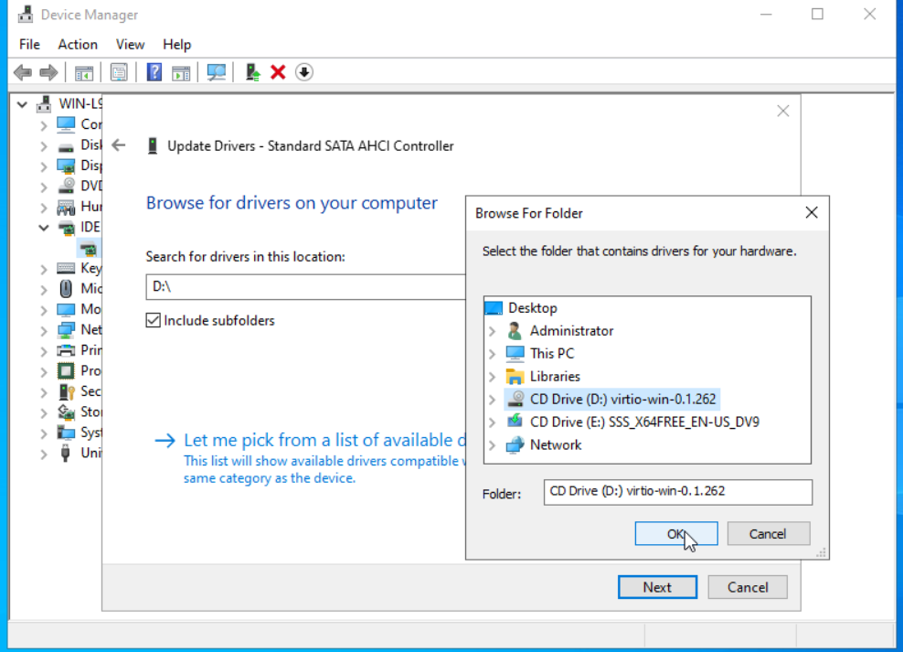

## 1. ISO Images
1. Download the **Windows Server 2022 Trial ISO** (usable for 180 days).
2. Download the **VirtIO drivers ISO** from [Proxmox VirtIO Drivers](https://pve.proxmox.com/wiki/Windows_VirtIO_Drivers).
3. Upload both ISO files to the Proxmox ISO storage.

## 2. Create VM
This section explains how to create a VM for Windows Server 2022.  
Compared to general Linux VMs, there are a few extra steps because a driver interface called [Virtio](https://wiki.osdev.org/Virtio) is required when hosting Windows Server 2022 on Proxmox.

1. In Proxmox, click **Create VM**.  
   
2. Configure the VM as shown in the following subsections.

**Important: Do not start the VM after creating it.**

#### 2.1 General
1. Set _Name_ to **Win2022**.  
   

#### 2.2 OS
1. Set _ISO image_ to **Windows Server 2022 ISO**.
2. Set _Type_ to **Microsoft Windows**.
3. Set _Version_ to **11/2022**.  
   

#### 2.3 System
1. Set _EFI Storage_ to the same storage used by the VM.
2. Set _TPM Storage_ to the same storage used by the VM.
3. Ensure _Qemu Agent_ is checked.
4. Set _SCSI Controller_ to **VirtIO SCSI**.  
   

#### 2.4 Disks
1. Set _Bus/Device_ to **SCSI**.
2. Set the disk size to **50GB** (or your preferred size).  
   

#### 2.5 CPU
1. Set _Cores_ to **2**.
2. Set _Type_ to **host**.  
   

#### 2.6 Memory
1. Set _Memory_ to **4096MB**.  
   

#### 2.7 Network
1. Set _Bridge_ to the bridge used for the network the host will join (e.g., the default **VMBR0**).  
   

#### 2.8 Confirm
1. Ensure that **Start after created** is unchecked, and click _Finish_.  
   

## 3. Prepare VM before First Start
1. Select _Hardware_.
2. Click **Add**, and choose **CD/DVD Drive**.  
   
3. In the pop-up window, set _Bus/Device_ to **IDE**, and for _Storage_, select the drive where the **VirtIO** ISO is located. Then, choose the **VirtIO** ISO as the _ISO Image_.  
   

## 4. Installing Windows Server
1. Start the Proxmox VM and switch to the console screen.
2. If you do not press any key fast enough during boot, restart the VM (send **Ctrl+Alt+Delete**).  
   
3. When asked for a product key, choose **I don't have a product key** to use the trial version.  
4. Select **Windows Server 2022 Standard (Desktop Experience)** (unless you only want PowerShell).  
   
5. Choose **Custom: Install Microsoft Server Operating System only**.  
   
6. Click **Load Driver**, and choose _Browse_. Select the _CD Drive_ with the **VirtIO** image and expand the drive.  
     
   
7. Find the folder _VIOSCSI_ and expand it. Locate the folder _2K22_, expand it, select the _amd64_ folder, click **OK**, and then click **Next**.  
   
8. Once the driver is installed, the disk should appear.
9. Click **New** to set up the disk, then click **Apply** and **Next**.  
   
10. Wait for the installation to finish.
11. Set your password when prompted.
12. Send **Ctrl+Alt+Delete** to access the login screen.  
    
13. Open _Device Manager_, and check if any drivers are missing. Install any missing drivers from the VirtIO drivers located on the local drive.  
      
      
    
